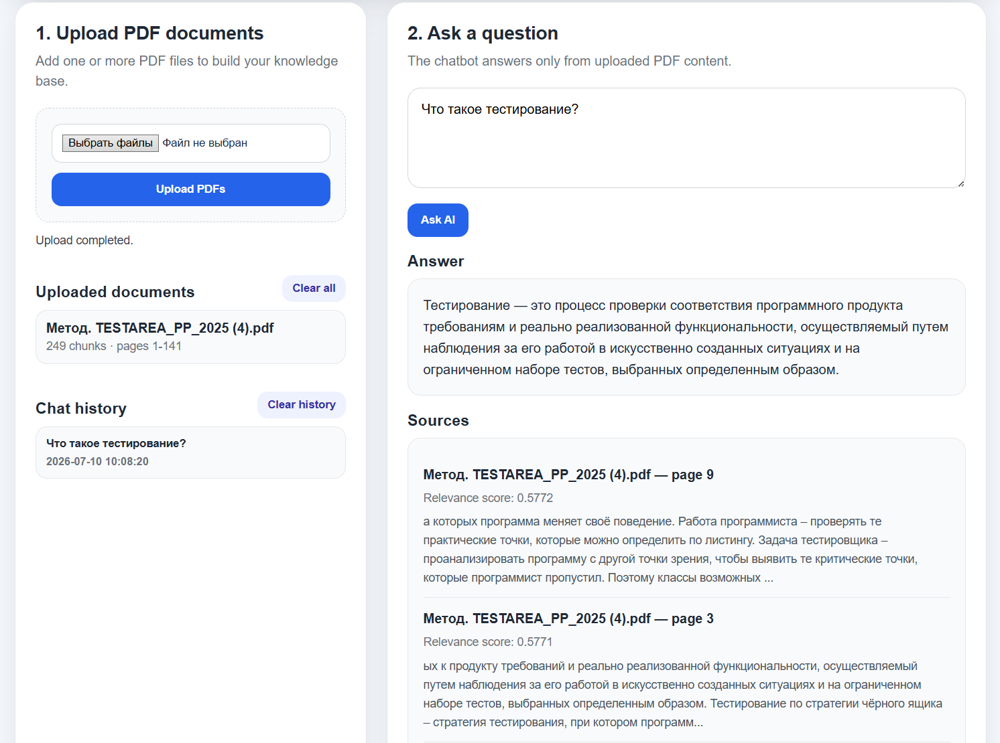

# AI PDF Knowledge Base Chatbot

AI chatbot that allows users to upload PDF documents, ask questions, and receive answers based only on the uploaded content.

The chatbot extracts text from PDFs, splits documents into searchable chunks, stores them in SQLite, retrieves relevant context for each question, and generates an AI answer with sources.

## Business Use Case

Many companies store important information in PDF files: internal policies, product documentation, onboarding guides, FAQs, contracts, reports, and knowledge base documents.

This project demonstrates how an AI assistant can help employees or customers quickly find answers from company documents without manually searching through long PDF files.

Example use cases:

- HR policy assistant
- Customer support FAQ chatbot
- Internal documentation assistant
- Legal document Q&A prototype
- Product manual chatbot
- Training material assistant

## Features

- Upload one or more PDF files
- Extract text from PDF pages
- Split documents into searchable chunks
- Store chunks in SQLite
- Ask questions from the web interface
- Retrieve relevant chunks using TF-IDF search
- Generate AI answers using an OpenAI-compatible API
- Show answer sources with file name and page number
- Clean web UI
- Loading states
- Error messages
- Empty state when no documents are uploaded
- Environment variables for API configuration
- No hardcoded API keys
- Business use case
- Features
- Tech stack
- Architecture
- Docker setup
- Demo scenario
- Screenshots
- Future improvements

## Screenshot



## Tech Stack

### Backend

- Python
- FastAPI
- SQLite
- PyMuPDF
- scikit-learn
- OpenAI-compatible API

### Frontend

- HTML
- CSS
- JavaScript

## Project Structure

```text
ai-pdf-knowledge-base-chatbot/
│
├── backend/
│   ├── app/
│   │   ├── main.py
│   │   ├── database.py
│   │   ├── pdf_service.py
│   │   ├── search_service.py
│   │   └── ai_service.py
│   │
│   ├── data/
│   ├── uploads/
│   └── requirements.txt
│
├── frontend/
│   ├── index.html
│   ├── styles.css
│   └── app.js
│
├── sample_pdfs/
├── screenshots/
├── README.md
├── .env.example
└── .gitignore
